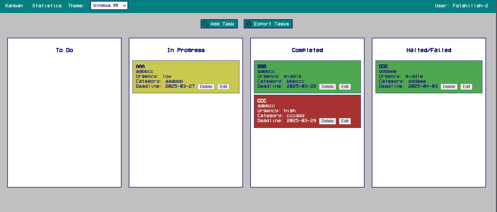
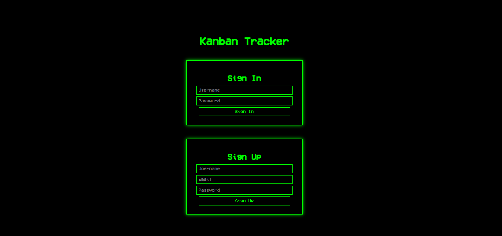
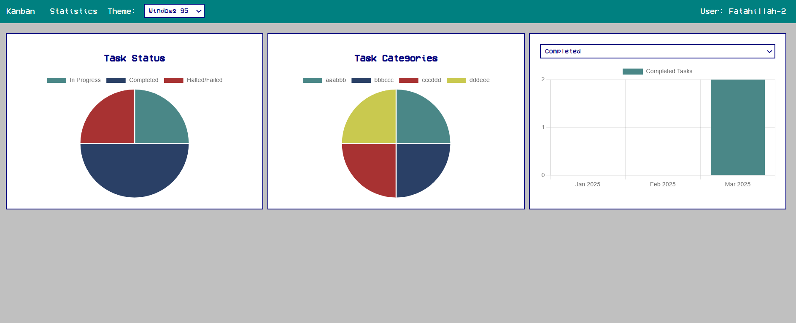

# Kanban Tracker



A retro-styled Kanban board application built with HTML, CSS, JavaScript, and Node.js. This app allows users to manage tasks with a drag-and-drop interface, track task statuses, and visualize statistics. It features a nostalgic design inspired by classic operating systems like Windows 95, DOS, and VGA, complete with a boot sequence animation, pixelated fonts, and retro icons.

## Features

- **Retro Themes**: Choose between three themes: Windows 95, DOS, and VGA, each with a distinct retro aesthetic.
- **Task Management**: Add, edit, delete, and drag-and-drop tasks across four columns: To Do, In Progress, Completed, and Halted/Failed.
- **Task Details**: Set task urgency (Low, Middle, High), category, and deadline. Tasks are color-coded based on urgency.
- **Statistics**: Visualize task status and category distribution with Chart.js-powered charts.
- **Export Tasks**: Export tasks to a text file with a retro floppy disk animation.
- **Boot Sequence**: A nostalgic boot sequence animation on the login page, mimicking old-school OS startup.
- **Retro Font**: Uses the VCR OSD Mono font for a pixelated, retro look.
- **User Authentication**: Sign up and sign in with a username, email, and password. User data is stored on the server.
- **Responsive Design**: Works on various screen sizes with a clean, centered layout.

## Screenshots

### Login Page


### Kanban Board


### Statistics Page


## Installation

### Prerequisites
- [Node.js](https://nodejs.org/) (v14 or higher)
- [npm](https://www.npmjs.com/) (comes with Node.js)

### Steps
1. **Clone the Repository**
   ```bash
   git clone https://github.com/your-username/kanban-tracker.git
   cd kanban-tracker
2. **Install Dependencies**
    ```bash
    npm install
3. **Start the Server**
    ```bash
    node server.js
4. Access the App Open your browser and navigate to http://localhost:3000/index.html.

## Usage
### 1. Sign Up or Sign In
>On the login page, sign up with a username, email, and password, or sign in if you already have an account.
>After signing in, you'll be redirected to the Kanban board.
### 2. Manage Tasks
>Click "Add Task" to create a new task with a title, description, urgency, category, and deadline.
>Drag and drop tasks between columns (To Do, In Progress, Completed, Halted/Failed).
>Edit or delete tasks using the buttons on each task card.
### 3. View Statistics
>Navigate to the "Statistics" tab to see charts of task statuses and categories.
>Filter completed tasks by status (Completed, In Progress, Halted/Failed).
### 4. Export Tasks
>Click "Export Tasks" to download a text file of your tasks, accompanied by a retro floppy disk animation.
### 5. Change Theme
>Use the theme selector in the menu bar to switch between Windows 95, DOS, and VGA themes.

## Project Structure
```
kanban-tracker/
├── assets/
│   ├── floppy-disk.png       # Floppy disk icon for export animation
│   ├── add-icon.png          # Icon for the "Add Task" button
│   ├── export-icon.png       # Icon for the "Export Tasks" button
│   └── VCR_OSD_Mono.ttf      # Retro font
├── screenshots/              # Screenshots for README
├── tasks/                    # Directory for storing task data
├── users/                    # Directory for storing user data
├── index.html                # Login page
├── main.html                 # Main Kanban board and statistics page
├── script.js                 # Client-side JavaScript logic
├── style.css                 # Styles for the app
├── server.js                 # Node.js server for user authentication and task storage
└── README.md                 # This file
```
## Technologies Used
```
>Frontend: HTML, CSS, JavaScript
>Backend: Node.js, Express.js
>Charting: Chart.js
>Font: VCR OSD Mono
>Storage: File system (tasks and users stored as JSON files)
```

## Future Improvements
```
>Electron App: Package the app as a desktop application using Electron.
>CSV Export: Enhance the export feature to support CSV format for better compatibility.
>CRT Effects: Add CRT scanline effects for an even more retro feel.
>Sound Effects: Include retro sound effects (e.g., typing sounds during boot sequence, floppy disk sound during export).
>Database: Replace file-based storage with a proper database (e.g., SQLite or MongoDB) for web-based user.
```

## Contributing
Contributions are welcome! Please follow these steps:

1. Fork the repository.
2. Create a new branch (git checkout -b feature/your-feature).
3. Make your changes and commit (git commit -m "Add your feature").
4. Push to your branch (git push origin feature/your-feature).
5. Open a pull request.

## Acknowledgments
1. CR OSD Mono Font(https://www.dafont.com/vcr-osd-mono.font) for the retro typography.
2. Chart.js(https://www.chartjs.org/) for the statistics charts.
3. Inspired by classic operating systems like Windows 95 and DOS.